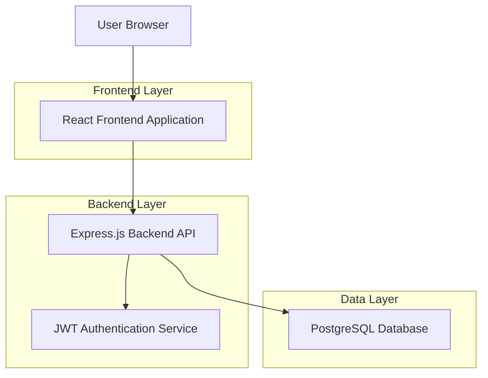
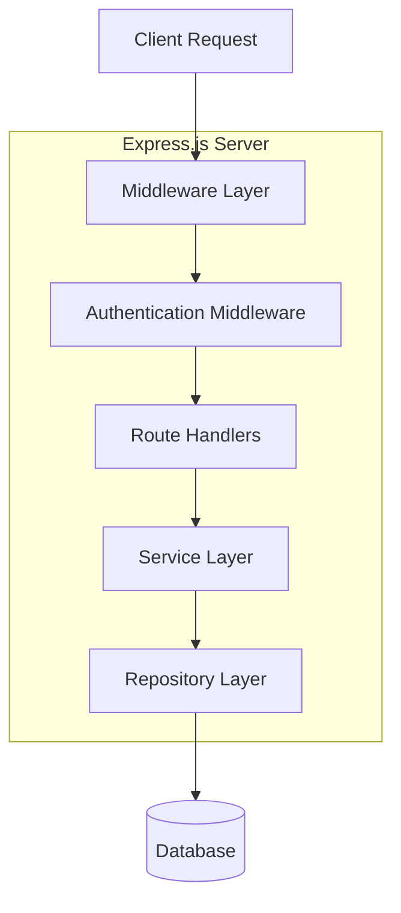
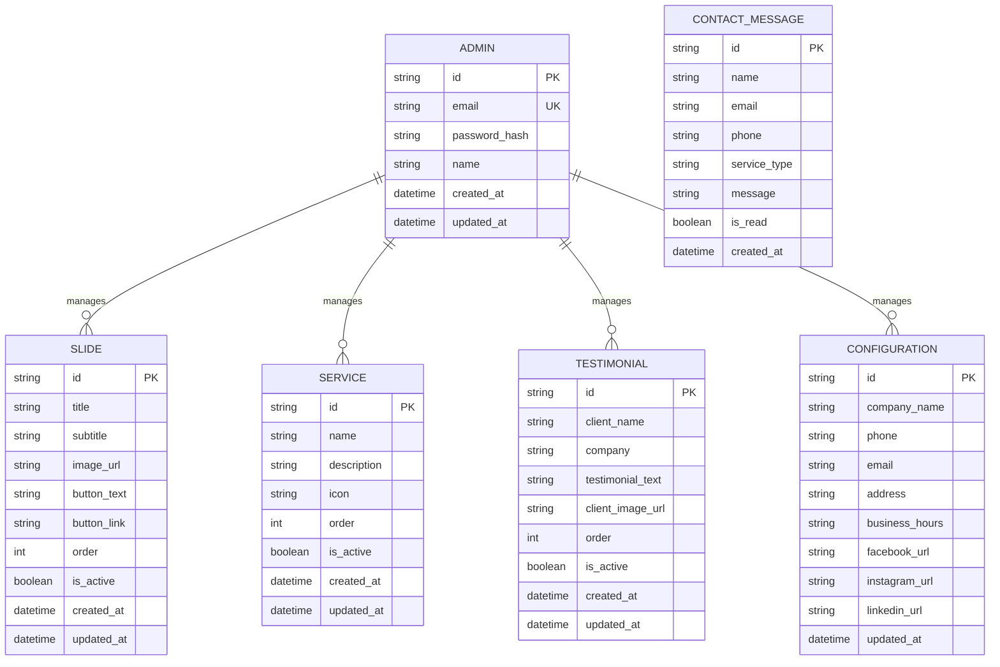
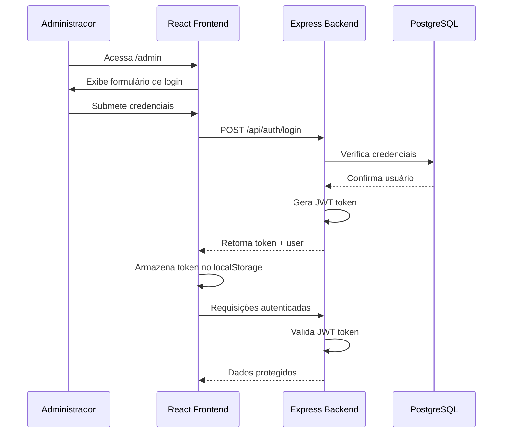

## 1. Arquitetura do Sistema



## 2. Tecnologias Utilizadas

- **Frontend**: React@18 + TypeScript@5 + Vite@5
- **Backend**: Express.js@4 + TypeScript@5 + Node.js@20
- **Banco de Dados**: PostgreSQL@15 + Prisma ORM@5
- **Autenticação**: JWT (jsonwebtoken@9) + bcrypt@5
- **Estilização**: TailwindCSS@3 + HeadlessUI
- **Validação**: Zod@3 (schema validation)
- **Upload de Arquivos**: Multer@2 + Sharp@3 (image processing)
- **CORS**: cors@2
- **Variáveis de Ambiente**: dotenv@16

## 3. Definição de Rotas

### Frontend Routes
| Rota | Descrição |
|------|-----------|
| / | Homepage principal com todas as seções |
| /admin | Página de login do administrador |
| /admin/dashboard | Dashboard administrativo |
| /admin/slides | Gerenciamento de slides do carrossel |
| /admin/servicos | Gerenciamento de serviços |
| /admin/depoimentos | Gerenciamento de depoimentos |
| /admin/configuracoes | Configurações gerais do site |

### Backend API Endpoints
| Método | Rota | Descrição |
|--------|------|-----------|
| POST | /api/auth/login | Autenticação do administrador |
| GET | /api/configuracoes | Obter configurações gerais do site |
| PUT | /api/configuracoes | Atualizar configurações gerais |
| GET | /api/slides | Listar todos os slides |
| POST | /api/slides | Criar novo slide |
| PUT | /api/slides/:id | Atualizar slide |
| DELETE | /api/slides/:id | Remover slide |
| GET | /api/servicos | Listar todos os serviços |
| POST | /api/servicos | Criar novo serviço |
| PUT | /api/servicos/:id | Atualizar serviço |
| DELETE | /api/servicos/:id | Remover serviço |
| GET | /api/depoimentos | Listar todos os depoimentos |
| POST | /api/depoimentos | Criar novo depoimento |
| PUT | /api/depoimentos/:id | Atualizar depoimento |
| DELETE | /api/depoimentos/:id | Remover depoimento |
| POST | /api/contato | Enviar mensagem de contato |

## 4. Definições de API

### 4.1 Autenticação
```typescript
POST /api/auth/login

Request Body:
{
  email: string;    // Email do administrador
  password: string; // Senha (mínimo 6 caracteres)
}

Response Success (200):
{
  token: string;    // JWT token
  user: {
    id: string;
    email: string;
    name: string;
  }
}

Response Error (401):
{
  error: string;    // "Credenciais inválidas"
}
```

### 4.2 Gerenciamento de Slides
```typescript
GET /api/slides
Response (200):
{
  slides: Array<{
    id: string;
    title: string;
    subtitle: string;
    imageUrl: string;
    buttonText: string;
    buttonLink: string;
    order: number;
    isActive: boolean;
  }>
}

POST /api/slides
Request Body (multipart/form-data):
{
  title: string;        // Título do slide
  subtitle: string;     // Subtítulo
  buttonText: string;   // Texto do botão
  buttonLink: string;   // Link do botão
  order: number;        // Ordem de exibição
  image: File;          // Imagem do slide (max 2MB)
}
```

### 4.3 Formulário de Contato
```typescript
POST /api/contato

Request Body:
{
  name: string;         // Nome completo (mínimo 3 caracteres)
  email: string;        // Email válido
  phone: string;       // Telefone (formato brasileiro)
  serviceType: string;  // Tipo de serviço desejado
  message: string;      // Mensagem (mínimo 10 caracteres)
}

Response Success (200):
{
  message: string;      // "Mensagem enviada com sucesso"
}

Response Error (400):
{
  error: string;        // Descrição do erro de validação
}
```

## 5. Arquitetura do Servidor



### Estrutura de Camadas:
- **Middleware Layer**: CORS, body-parser, error handling
- **Authentication**: JWT validation para rotas protegidas
- **Route Handlers**: Validação de entrada e resposta HTTP
- **Service Layer**: Lógica de negócios e processamento
- **Repository Layer**: Acesso a dados via Prisma ORM

## 6. Modelo de Dados

### 6.1 Diagrama ER


### 6.2 DDL - Definição de Tabelas

```sql
-- Tabela de Administradores
CREATE TABLE admins (
    id UUID PRIMARY KEY DEFAULT gen_random_uuid(),
    email VARCHAR(255) UNIQUE NOT NULL,
    password_hash VARCHAR(255) NOT NULL,
    name VARCHAR(100) NOT NULL,
    created_at TIMESTAMP WITH TIME ZONE DEFAULT NOW(),
    updated_at TIMESTAMP WITH TIME ZONE DEFAULT NOW()
);

-- Tabela de Slides
CREATE TABLE slides (
    id UUID PRIMARY KEY DEFAULT gen_random_uuid(),
    title VARCHAR(255) NOT NULL,
    subtitle VARCHAR(255),
    image_url VARCHAR(500) NOT NULL,
    button_text VARCHAR(100),
    button_link VARCHAR(500),
    "order" INTEGER DEFAULT 0,
    is_active BOOLEAN DEFAULT true,
    created_at TIMESTAMP WITH TIME ZONE DEFAULT NOW(),
    updated_at TIMESTAMP WITH TIME ZONE DEFAULT NOW()
);

-- Tabela de Serviços
CREATE TABLE services (
    id UUID PRIMARY KEY DEFAULT gen_random_uuid(),
    name VARCHAR(255) NOT NULL,
    description TEXT NOT NULL,
    icon VARCHAR(100),
    "order" INTEGER DEFAULT 0,
    is_active BOOLEAN DEFAULT true,
    created_at TIMESTAMP WITH TIME ZONE DEFAULT NOW(),
    updated_at TIMESTAMP WITH TIME ZONE DEFAULT NOW()
);

-- Tabela de Depoimentos
CREATE TABLE testimonials (
    id UUID PRIMARY KEY DEFAULT gen_random_uuid(),
    client_name VARCHAR(255) NOT NULL,
    company VARCHAR(255),
    testimonial_text TEXT NOT NULL,
    client_image_url VARCHAR(500),
    "order" INTEGER DEFAULT 0,
    is_active BOOLEAN DEFAULT true,
    created_at TIMESTAMP WITH TIME ZONE DEFAULT NOW(),
    updated_at TIMESTAMP WITH TIME ZONE DEFAULT NOW()
);

-- Tabela de Mensagens de Contato
CREATE TABLE contact_messages (
    id UUID PRIMARY KEY DEFAULT gen_random_uuid(),
    name VARCHAR(255) NOT NULL,
    email VARCHAR(255) NOT NULL,
    phone VARCHAR(50),
    service_type VARCHAR(100),
    message TEXT NOT NULL,
    is_read BOOLEAN DEFAULT false,
    created_at TIMESTAMP WITH TIME ZONE DEFAULT NOW()
);

-- Tabela de Configurações
CREATE TABLE configurations (
    id UUID PRIMARY KEY DEFAULT gen_random_uuid(),
    company_name VARCHAR(255) DEFAULT 'Empresa Contábil',
    phone VARCHAR(50),
    email VARCHAR(255),
    address TEXT,
    business_hours VARCHAR(255),
    facebook_url VARCHAR(500),
    instagram_url VARCHAR(500),
    linkedin_url VARCHAR(500),
    updated_at TIMESTAMP WITH TIME ZONE DEFAULT NOW()
);

-- Índices para performance
CREATE INDEX idx_slides_order ON slides("order");
CREATE INDEX idx_slides_active ON slides(is_active);
CREATE INDEX idx_services_order ON services("order");
CREATE INDEX idx_services_active ON services(is_active);
CREATE INDEX idx_testimonials_order ON testimonials("order");
CREATE INDEX idx_testimonials_active ON testimonials(is_active);
CREATE INDEX idx_contact_messages_created ON contact_messages(created_at DESC);

-- Inserir admin padrão (senha: admin123)
INSERT INTO admins (email, password_hash, name) 
VALUES ('admin@empresa.com', '$2b$10$92IXUNpkjO0rOQ5byMi.Ye4oKoEa3Ro9llC/.og/at2.uheWG/igi', 'Administrador');

-- Inserir configurações padrão
INSERT INTO configurations (company_name, phone, email, address, business_hours) 
VALUES ('Empresa Contábil Ltda', '(11) 1234-5678', 'contato@empresacontabil.com.br', 'Rua Exemplo, 123 - São Paulo/SP', 'Seg-Sex: 8h-18h');
```

## 7. Estrutura de Pastas do Projeto

```
site-contabil/
├── frontend/                    # React TypeScript Application
│   ├── src/
│   │   ├── components/         # Componentes React reutilizáveis
│   │   │   ├── ui/          # Componentes base (Button, Input, Card)
│   │   │   ├── sections/    # Seções da homepage (Hero, Services, etc)
│   │   │   └── admin/       # Componentes específicos do admin
│   │   ├── pages/           # Páginas principais
│   │   ├── hooks/           # Custom React hooks
│   │   ├── services/        # Integração com API
│   │   ├── types/           # Definições TypeScript
│   │   ├── utils/           # Funções utilitárias
│   │   └── styles/          # Estilos globais e Tailwind
│   ├── public/              # Assets estáticos
│   └── package.json
│
├── backend/                   # Express.js TypeScript API
│   ├── src/
│   │   ├── controllers/      # Lógica de requisições/respostas
│   │   ├── services/        # Lógica de negócios
│   │   ├── repositories/    # Acesso a dados (Prisma)
│   │   ├── middlewares/     # Middlewares (auth, error handling)
│   │   ├── routes/          # Definições de rotas
│   │   ├── types/           # Definições TypeScript
│   │   ├── utils/           # Funções utilitárias
│   │   └── config/          # Configurações do servidor
│   ├── prisma/             # Schema e migrations
│   └── package.json
│
├── shared/                   # Código compartilhado
│   └── types/               # Tipos compartilhados
│
└── docker-compose.yml       # Configuração Docker
```

## 8. Fluxo de Autenticação



## 9. Plano de Implementação

### Fase 1 - Estrutura Base (2 dias)
- [ ] Configurar ambiente de desenvolvimento
- [ ] Criar estrutura de pastas do projeto
- [ ] Configurar TypeScript, ESLint e Prettier
- [ ] Configurar TailwindCSS no frontend
- [ ] Configurar Express.js e Prisma no backend

### Fase 2 - Backend API (3 dias)
- [ ] Implementar autenticação JWT
- [ ] Criar todas as tabelas do banco
- [ ] Implementar CRUD de slides
- [ ] Implementar CRUD de serviços
- [ ] Implementar CRUD de depoimentos
- [ ] Implementar configurações gerais
- [ ] Implementar endpoint de contato

### Fase 3 - Frontend Homepage (3 dias)
- [ ] Criar componentes base (Button, Input, Card)
- [ ] Implementar hero section com carrossel
- [ ] Criar seção "Sobre a Empresa"
- [ ] Implementar seção de serviços
- [ ] Criar seção de depoimentos
- [ ] Implementar formulário de contato
- [ ] Criar footer com informações

### Fase 4 - Área Administrativa (3 dias)
- [ ] Criar tela de login
- [ ] Implementar dashboard com estatísticas
- [ ] Criar interface de gerenciamento de slides
- [ ] Implementar gerenciamento de serviços
- [ ] Criar interface de gerenciamento de depoimentos
- [ ] Implementar página de configurações

### Fase 5 - Integração e Testes (2 dias)
- [ ] Integrar frontend com backend
- [ ] Implementar tratamento de erros
- [ ] Adicionar loading states
- [ ] Testar responsividade
- [ ] Testar fluxo completo de autenticação
- [ ] Validar formulários e máscaras

### Fase 6 - Deploy e Otimização (2 dias)
- [ ] Configurar build de produção
- [ ] Otimizar imagens e assets
- [ ] Configurar variáveis de ambiente
- [ ] Deploy no servidor
- [ ] Configurar SSL e domínio
- [ ] Testes finais em produção

**Tempo Total Estimado**: 15 dias úteis