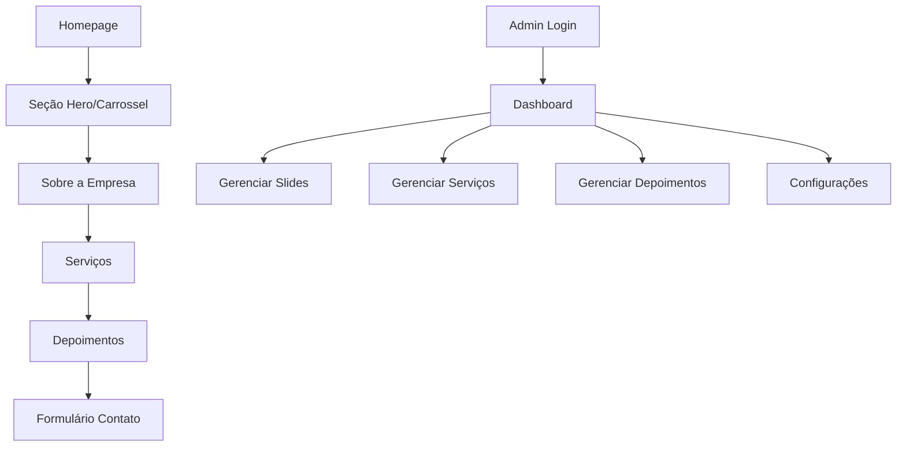

## 1. Visão Geral do Produto

Site institucional para empresa de contabilidade com design moderno e área administrativa para gestão de conteúdo. O objetivo é apresentar os serviços contábeis de forma profissional, transmitindo confiança e credibilidade aos clientes potenciais.

O site atenderá pequenas e médias empresas que buscam serviços contábeis especializados, facilitando o primeiro contato e demonstrando a expertise da empresa no setor.

## 2. Funcionalidades Principais

### 2.1 Páginas do Site

O site será composto pelas seguintes páginas principais:

1. **Homepage**: Seção hero com carrossel de destaques, apresentação da empresa, serviços oferecidos, depoimentos de clientes e formulário de contato.
2. **Área Administrativa**: Sistema de login para administradores com dashboard para gerenciamento de conteúdo do site.

### 2.2 Detalhamento das Funcionalidades

| Página | Módulo | Descrição das Funcionalidades |
|--------|--------|-------------------------------|
| Homepage | Hero Section com Carrossel | Carrossel automático com 3-5 slides apresentando os principais serviços, com navegação manual via dots/bullets, transições suaves e call-to-action destacado |
| Homepage | Sobre a Empresa | Seção com texto institucional, foto da equipe, valores e missão da empresa contábil |
| Homepage | Serviços | Cards responsivos apresentando serviços como: abertura de empresa, contabilidade consultiva, departamento pessoal, fiscal e tributária, legalização de empresas |
| Homepage | Depoimentos | Carrossel de depoimentos de clientes com nome, empresa e avaliação |
| Homepage | Formulário de Contato | Formulário com campos para nome, email, telefone, tipo de serviço e mensagem, com validação e envio para email da empresa |
| Homepage | Footer | Informações de contato, horário de atendimento, links sociais e mapa do site |
| Admin | Login | Tela de autenticação com email e senha, com validação e redirecionamento para dashboard |
| Admin | Dashboard | Visão geral com estatísticas de acessos, últimas alterações e atalhos para gerenciamento |
| Admin | Gerenciar Slides | CRUD completo para slides do carrossel principal: adicionar, editar, ordenar e remover slides com upload de imagens |
| Admin | Gerenciar Serviços | CRUD para serviços oferecidos: nome, descrição, ícone e ordem de exibição |
| Admin | Gerenciar Depoimentos | CRUD para depoimentos: nome do cliente, empresa, texto e foto |
| Admin | Configurações | Edição de informações básicas da empresa: telefone, email, endereço, horários e redes sociais |

## 3. Fluxo de Navegação

### Fluxo do Visitante:
1. Usuário acessa a homepage
2. Visualiza o carrossel principal com destaques
3. Navega pelas seções de serviços e sobre
4. Ao final, pode enviar mensagem via formulário de contato

### Fluxo do Administrador:
1. Acessa página de login (/admin)
2. Realiza autenticação com credenciais
3. É redirecionado para dashboard administrativo
4. Pode gerenciar todo conteúdo do site através do menu lateral

## 4. Design System

### 4.1 Paleta de Cores
- **Cor Primária**: #6FA56B (Verde principal)
- **Cor Secundária**: #78B06F (Verde claro)
- **Cor de Apoio**: #4A7C46 (Verde escuro)
- **Neutros**: #FFFFFF, #F5F5F5, #333333, #666666
- **Cor de Ação**: #2D5A2A (Verde mais escuro para hover)

### 4.2 Tipografia
- **Fonte Principal**: 'Inter' ou 'Roboto' - moderna e legível
- **Títulos**: 32px-48px, peso 700
- **Subtítulos**: 18px-24px, peso 600
- **Texto Corpo**: 16px, peso 400
- **Texto Pequeno**: 14px, peso 400

### 4.3 Elementos de UI
- **Botões**: Estilo arredondado (border-radius: 8px), com estados de hover e focus visíveis
- **Cards**: Sombra suave (box-shadow: 0 2px 10px rgba(0,0,0,0.1))
- **Formulários**: Inputs com bordas arredondadas, labels sempre visíveis
- **Navegação**: Header fixo com scroll suave entre seções

### 4.4 Responsividade
- **Desktop**: 1200px+ (layout completo com todos os elementos)
- **Tablet**: 768px-1199px (ajustes de grid e tipografia)
- **Mobile**: 320px-767px (menu hambúrguer, coluna única, fontes menores)

## 5. Requisitos Não-Funcionais

### 5.1 Performance
- Tempo de carregamento inicial < 3 segundos
- Otimização de imagens (WebP quando possível)
- Lazy loading para imagens fora da viewport
- Minificação de CSS e JavaScript

### 5.2 SEO e Acessibilidade
- Meta tags apropriadas para cada página
- Estrutura semântica HTML5
- ALT text em todas as imagens
- Contraste de cores WCAG 2.1 AA
- Navegação por teclado funcional

### 5.3 Segurança
- Autenticação com JWT tokens
- Proteção contra SQL injection
- Validação de inputs no frontend e backend
- Rate limiting no formulário de contato
- HTTPS obrigatório

### 5.4 Compatibilidade
- Suporte para Chrome, Firefox, Safari, Edge (últimas 2 versões)
- Degraduação graciosa para browsers antigos
- Funcionalidade básica sem JavaScript ativado